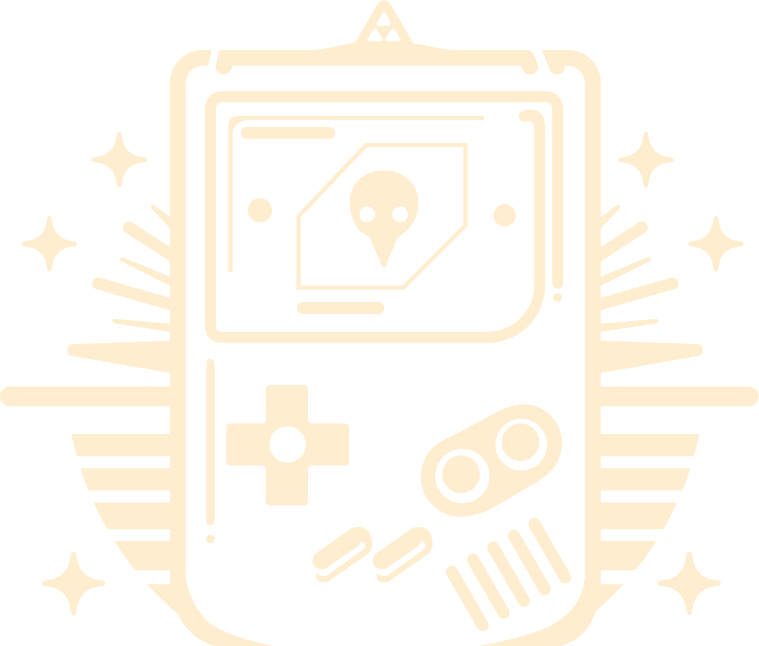

<!-- PROJECT LOGO -->
 

  
  <h2 align="center">Friky Blog</h2>
  <a href="https://code-blog-lime.vercel.app/">Visitar Blog</a>

<!-- TABLE OF CONTENTS -->

  
Tabla de Contenidos

  <ol>
    <li>
      <a href="#sobre-el-proyecto">Sobre el proyecto</a>
      <ul>
        <li><a href="#creado-con">Creado con</a></li>
      </ul>
    </li>
    <li>
      <a href="#roadmap">Roadmap</a>
    </li>
    <li><a href="#sobre-mí">Sobre Mí</a></li>
    <li><a href="#agradecimientos">Agradecimientos</a></li>
    <li><a href="#desafío-técnico">Desafío Técnico</a></li>
    <li><a href="#gran-error">Gran Error</a></li>
  </ol>

<!-- ABOUT THE PROJECT -->

## Sobre el proyecto

Este es mi proyecto personal de creación de un blog, dónde he querido desafiar mis habilidades creando algo que permitiera poner a prueba mis habilidades adquiridas además de permitirme un alto nivel de creatividad i funcionalidad al proyecto. Desde el hecho de escribir el cçodigo por mi mismo hasta poder ponerme creativo al crear contenido para el blog.

Desde que hice mis últimos proyectos, con este he querido seguir utilizando herramientas con las que me sintiera cómodo de utilizar y seguir un esquema básico de blog. Formado a partir de una SPA (Single Page Application) con una enrutación para poder moverse por las diferentes Views del proyecto.

Este contiene los siguientes apartados:

- Páginas de Inicio de Sesión y de Inscribirse (SignUp and SignIn): Apartado dónde se puede dar de alta en la página como iniciar sesión en esta. De visualización sencilla donde se pide un correo electrónico y una contraseña con la posibilidad de visualizar esta por parte del usuario.

- Página principal (Home View): Vista principal del blog donde a parte de empezar a visualizar la barra de navegación, se muestran los diferentes Posts que he añadido. Se muestra una vision del post más un link que te traslada a PostView.

- Página Single Post (Post View): Esta vista contiene el mismo post del que se ha redirigido, además de contener un espacio para comentarios donde el usuario puede comentar y/o borrar el comentario/s. Hay una paginación para la muestra de los comentarios de mas nuevo a mas antiguo.

- Perfil (Profile View): Una vista sencilla donde se muestra la imagen de usuario, su nombre de usuario y el correo con el que se inscribió. Contiene la opción de editar el perfil que traslada a la siguiente vista.

- Editar Perfil (Profile Edit): Esta vista permite cambiar la imagen y el nombre del usuario.

- Postear (Posting): Vista creada para el admin, que permite crear posts añadiendo el titulo, contenido, etiquetar y añadir imagenes desde una url.

(<a href="#readme-top">back to top</a>)

### Creado con

Este proyecto lo he creado usando <a href="https://vuejs.org">VUE</a> framework (HTML, JS) junto con <a href="https://tailwindcss.com">Tailwind</a> (CSS) library. Utilizo estas librerías porque son con las que más fluidez tengo además de facilitarme la construcción de la web.

Para la parte de la gestión de Backend he optado por utilizar <a href="https://supabase.com">Supabase</a> ya que me aporta de forma gratuita una opción super fácil para tener el proyecto en la red, y para la parte de frontend el proyecto esta alojado en <a href="https://vercel.com">Vercel</a>, que me permite visualizar perfectamente el estado final del proyecto.

(<a href="#readme-top">back to top</a>)

## Roadmap

Para este proyecto personal que he estado desarrollando por mi cuenta y para dar rienda suelta a mi creatividad no he seguido un roadmap como tal. Ha sido desarrollado en mis tiempos libres tanto para mejorar mis habilidades como para poder añadir contenido a mi biblioteca de proyectos personales.

Empezé con crear el proyecto en VUE, hice la conexion con Supabase para tener un backend más rápidamente subido en la red y me puse a programar. Comencé con las views para registrarse, continuando con las views que muestran contenido y finalizando con la parte de About.

Aunque ya está en una fase final seguiré mejorando este proyecto a medida que pase el tiempo, refinando el codigo como añadiendo contenido para dar vida a este proyecto.

(<a href="#readme-top">back to top</a>)

## Sobre Mí

Joaquim Crous - [@quim_dev](https://x.com/quim_dev) - joaquimcrous@gmail.com

Project Link: [https://github.com/QuimCrous/code_blog](https://github.com/QuimCrous/code_blog)

Presentation Link: [https://www.linkedin.com/in/joaquim-crous-mayné/](https://www.linkedin.com/in/joaquim-crous-mayné/)

Portfolio Link: [https://cv-jcm.vercel.app](https://cv-jcm.vercel.app)

#### Experiencia Académica

- Backend Web Development Java - Ironhack Barcelona

- Fronted Web Development - Iroonhack Barcelona

(<a href="#readme-top">back to top</a>)

## Agradecimientos

- Quiero dar las gracias a todos los que me han acompañado en este proyecto, desde la gente de mi alrededor como a los profesionales que me han dado sus consejos para dar vida a este proyecto.
- [Página de consulta](https://www.w3schools.com/js/default.asp)
- [Página de ChatGPT](https://openai.com/blog/chatgpt/)
- [Página de OMOURO studio (diseño de logos)](https://www.instagram.com/0mouro/)

(<a href="#readme-top">back to top</a>)

## Desafío Técnico

- Lo que considero como desafío técnico es el encontrarme a crear todo un proyecto por mi cuenta en los tiempos libres de los que dispongo. Desarrollar con un lenguaje que está en constante evolución dificulta en cierta medida el trabajo, ya que se tiene que tener en cuenta que ciertas cosas pasan a estar obsoletas mientras otras cambian la forma en la que se escriben. Aun así he disfrutado cada paso que he dado por pequeño que este sea.

(<a href="#readme-top">back to top</a>)

## Gran Error

- El gran error que he cometido es simple, creer que podría gestionar este proyecto por mi cuenta en menos tiempo del que me ha llevado. Al estar creado en mis momentos libres del trabajo dificultaba la continuidad de lo que estaba desarrollando, pero ha sido algo que he podido solucionar manteniendo una forma de trabajar de finalizar en cada momento la parte que estaba desarrollando.

(<a href="#readme-top">back to top</a>)

